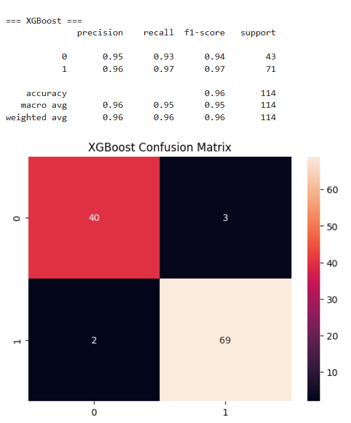
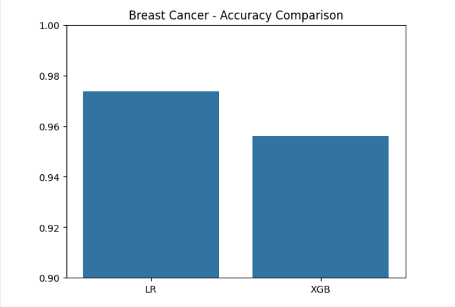

# 🧠 Breast Cancer Prediction using Machine Learning

This project uses machine learning algorithms like **Logistic Regression** and **XGBoost** to predict whether a tumor is **malignant (cancerous)** or **benign (non-cancerous)** based on real-world medical data.

The dataset is sourced from the **UCI Machine Learning Repository** via `scikit-learn`. This project allows users to test different models and even make predictions based on **custom input**.

---

## 📌 Features

- 📊 Uses the **Breast Cancer Wisconsin dataset** (from `sklearn.datasets`)
- 🔍 User can give **partial input**, rest auto-filled using dataset average
- ✅ Models used:
  - Logistic Regression
  - XGBoost
- 📈 Model performance shown via:
  - Confusion matrix
  - Classification report (Precision, Recall, F1-score)
  - Accuracy comparison bar chart
- 📦 Built and tested on Google Colab (can be run locally too)

---

## Run the notebook:  
Open `breast_cancer_prediction.ipynb` in Google Colab or Jupyter Notebook.

---

## 📷 Sample Output

---
---

## 🔧 Tech Stack

| Tool / Library     | Purpose                      |
|--------------------|------------------------------|
| Python             | Programming language         |
| scikit-learn       | ML models and preprocessing  |
| XGBoost            | Advanced gradient boosting   |
| Pandas, NumPy      | Data handling                |
| Seaborn, Matplotlib| Visualization                |

---
## 📬 Contact

Created by **Kushagra**  
Connect on [LinkedIn](https://www.linkedin.com/in/kushagra-singh-b86695297/) | Mail: kushagrasingh54321@gmail.com

